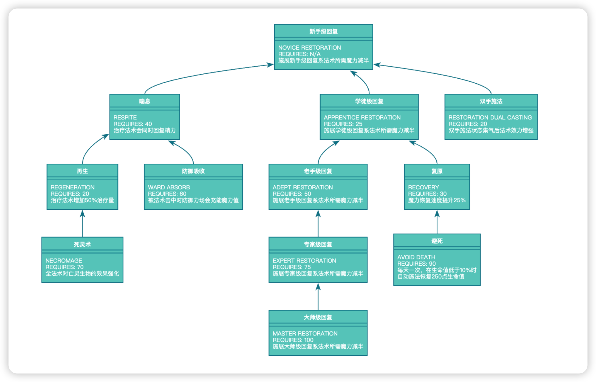

# CanvasTree

本项目使用canvas原生代码渲染树结构数据为树形图，是一个轻量级，易扩展的web组件。渲染结果中的根据算法都自适应到最佳位置，节点数据可以动态修改。另外还提供了节点间的关联文字的渲染和节点链接的功能。

This project uses native canvas code to render tree structure data into a tree diagram. It is a lightweight and easily extensible web component. The rendering results are automatically adapted to the best position according to the algorithm, and the node data can be dynamically modified. In addition, it also provides the rendering of associated text between nodes and the function of node links.

**显示效果**：

Rendering Result:



**使用方法**：

How to use

修改data中的数据即可，注意根节点的parent要设置成$ROOT$，字段含义：

You can modify the data directly. Please note that the parent of the root node should be set to $ROOT$. The meaning of each field is as follows:

```txt
title 节点标题，并作为节点名称成为其他节点的parent的值
contents 节点中的内容
parent 父结点，就是其他节点的标题
associate 关联文字，表征节点之间的关系
link 节点点击后跳转的链接
```

## License

[Mozilla Public License v2.0]